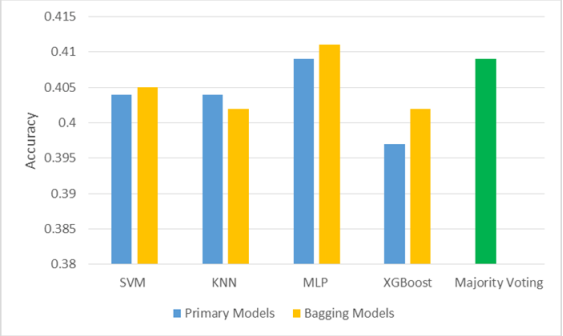
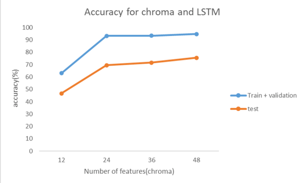
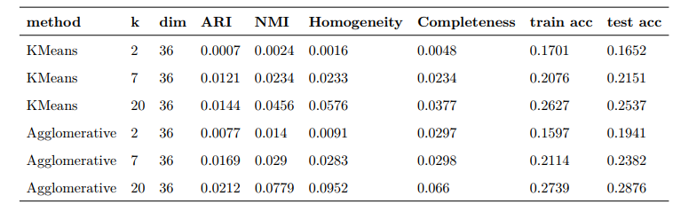

# Iranian Music Dastgah Detection

The final project of Machine Learning course of University of Tehran.

## Data

The entire collection of 949 songs is accessible
on [google drive](https://drive.google.com/drive/folders/159_lm5_TDupzbVMw--hdXGEARzCS8Q4g?usp=sharing)

## Feature extraction

We used the Liborsa library for feature extraction in this project, and we pulled the Mfcc and Chroma features.

## Models

* Classification
    * SVM
    * KNN
    * MLP
    * XGBoost
    * Majority Voting
    * LSTM

* Clustering
    * KMeans
    * Agglomerative

## Results

* Classification
  
* LSTM
  
* Clustering
  